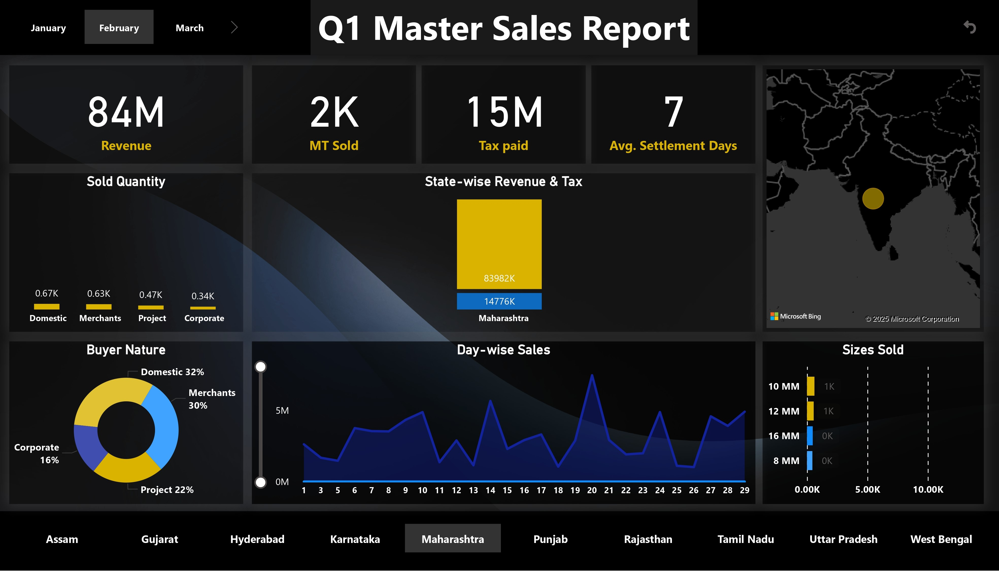

# sales_report | Power BI

## 📌 Project Summary
This Power BI dashboard captures Q1 sales data across multiple Indian states, buyers, and product sizes. It enables senior management to monitor tax-paid sales, revenue distribution, and customer segmentation with high clarity.

Created for performance tracking, the dashboard presents valuable insights to boost sales decisions and market strategies.

---

## 📊 Key Highlights
- 💸 **Revenue Tracking** – ₹2B+ in total revenue displayed interactively.
- 🛒 **Buyer Segmentation** – Merchant, Project, Corporate, and Domestic sales breakdown.
- 🌍 **State-wise Sales** – Performance across 10+ Indian states.
- 📅 **Day-wise Trends** – Daily sales patterns to understand seasonal cycles.
- 📦 **Size-wise MT Sold** – Analyze demand by product size category.

---

## 🛠️ Tools Used
- **Power BI** for dashboard creation
- **Excel/CSV** for source data
- **SQL/DAX** for query & modification
---

## 🖼️ Screenshot

---

## 🎯 Purpose
- Offer real-time sales insights to top executives.
- Identify underperforming regions or buyer segments.
- Streamline weekly/monthly sales reporting.

---

## 📬 Connect with Me
- **LinkedIn**: www.linkedin.com/in/roysubh  
- **Email**: business.sroy@gmail.com  

> ⭐ Star this repo if you liked the insights, or connect to discuss improvements!
